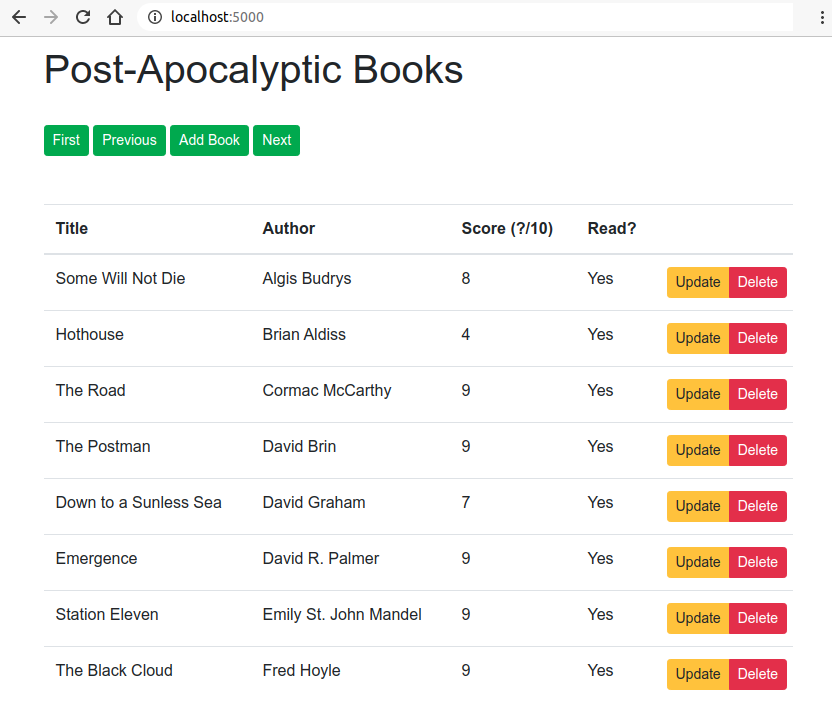
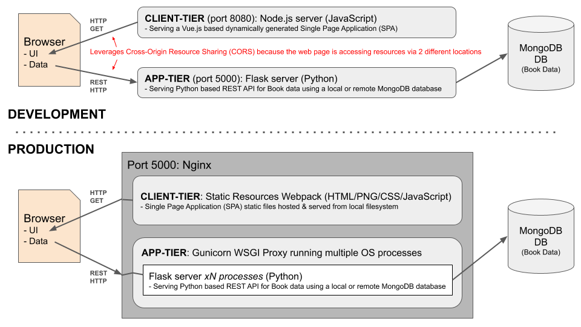

# Introduction

An example full stack application, primarily developed in Python, which displays a sample set of books related to [Post-Apocalyptic fiction](https://en.wikipedia.org/wiki/Apocalyptic_and_post-apocalyptic_fiction) and enables these to be edited.

 

### Main Goals

* Provide an example of an easy way to develop a full stack application, for developers who prefer using Python, without needing to use JavaScript to develop the app-tier logic or needing to leverage Node.js to run the application in Production. 
* Enable the app-tier to be scalable, with a simple non-invasive way of leveraging multiple host server cores/processes, without being constrained by Python's Global Interpreter Lock (GIL), in a way that enables the developer to just focus on writing normal Python code.
* Host the data-tier on a [MongoDB](https://www.mongodb.com/) database for flexibility, high availability, scalability and portability reasons.
* Use JavaScript in the client-tier, in the browser where JavaScript shines, to avoid server-side rendering of the user interface, to provide a more responsive and smooth user experience, realised as a Single Page Application ([SPA](https://en.wikipedia.org/wiki/Single-page_application)) and loaded into the browser as a set of static resources (bundled as a [Webpack](https://webpack.js.org/)).
 
### Application Architecture

To achieve these goals, the component stack shown in the diagram below has been adopted, with differences between the development and production environments. The development environment allows rapid prototyping with a single instance of a Python application and an auto-checked and auto-generated web user interface. The production environment provides a more scalable multi-process solution and completely eliminates server-side JavaScript and Node.js from the runtime.

 

Further details on some of the components

* __[Vue.js](https://vuejs.org/)__: A JavaScript framework for building user interfaces as Single Page Applications that, in production, is served as a set of static HTML/JavaScript/PNG/CSS resources to run inside the browser, requiring no server-side rendering. Node.js is used during the development phase only to check for issues and to dynamically generate the content for quick prototyping
* __[Flask](https://flask.palletsprojects.com/en/1.1.x/)__: A lightweight single process Python micro web framework for dynamically generating server-side rendered web applications, or, in this case, APIs such as REST APIs.
* __[Gunicorn](https://gunicorn.org/)__: A Python Web Server Gateway Interface ([WSGI](https://en.wikipedia.org/wiki/Web_Server_Gateway_Interface)) which is able to fork and manage multiple host processes to each run a copy of single-process Python server frameworks like _Flask_. Via WSGI, integrates with common web servers like Apache and Nginx to enable those web servers to reverse proxy URL requests through to the Python business logic running in each Gunicorn spawned process.
* __[Nginx](https://www.nginx.com/)__: An HTTP web server for serving static websites or, acting as a reverse proxy / load balancer, serving dynamically generated content & exposing  request/response APIs. In this project it is used for both roles: to serve the static HTML files, JavaScript client-side libraries plus other resources, and to expose a REST API proxied through Gunicorn & Flask

&nbsp;

# Installation

### Prerequisites/Assumptions

* A MongoDB database is already [installed](https://docs.mongodb.com/manual/tutorial/install-mongodb-on-ubuntu/) or running somewhere (e.g. a local single instance, a remote self-managed cluster or an [Atlas](https://www.mongodb.com/cloud/atlas) cluster in the public cloud)
* These instructions assume the host OS is Ubuntu 20.40 - most of the steps should be easily transferrable to other OSess but some changes may be required
* If the option of running the app via a Docker container is to be used, ensure the local OS has [Docker](https://docs.docker.com/get-docker/) already installed and running

_NOTE_: See [here](how-created.md) for details on how the original _skeleton_ outline for the client-tier Vue.js part of the project was created.

### Software Installation

1. Install Python 3 (including its package manager, _pip_), Node.js (including its package manager, _npm_) and Nginx:
```bash
sudo apt install python3 python3-pip nodejs npm nginx
```

2. Ensure the location `~/.local/bin` is on the OS user's path (__change__ _mainuser_ to your local user name) by editing `.bashrc` (restart the terminal afterwards to pick up this change):
```bash
export PATH=/home/mainuser/.local/bin:$PATH
```

3. Install the system-wide required Python & Node.js libraries/tools:
```bash
pip3 install --user pymongo dnspython python-dotenv Flask Flask-Cors gunicorn
sudo npm install -g @vue/cli
```

3. Install the project-local required Node.js libraries/tools (dependencies are declared in the `package.json` file):
```bash
cd client-tier
npm install
```

### Database Records Creation

1. Run the following command which uses the Mongo Shell to insert a sample set of book records into the database (first __change__ the MongoDB URL argument to match the location of the running MongoDB database):
```bash
mongo mongodb://localhost:27017 rawdata/book-data-to-insert.js
```

&nbsp;

# Running the application

Follow the __DEVELOPMENT Phase__ instructions below to change and enhance the running application in development mode with easy debugging. Follow the __PRODUCTION Phase__ instructions to deploy this in a production-like way, where debugging plus auto-regeneration of the client-tier resources are disabled and with the Python REST API being served from multiple server-side processes, for increased throughput and scale. There are two options for the PRODUCTION Phase (just choose one): __1)__ Non-Containerised Production Server (run the app directly from the host OS), or __2)__ Containerised Production Server (run the app from within a Docker container)


&nbsp;

### DEVELOPMENT Phase

1. Edit the `.env` file in the root of the project, setting the value of the `FLASK_ENV` variable to `development` (which will aid rapid prototyping) and the value of the `MONGODB_URL` variable to match the location of the running development MongoDB database. For example: 
```bash
FLASK_ENV="development"
MONGODB_URL="mongodb://localhost:27017"
```

2. Start the app-tier which will run a single process and single threaded Flask server, in debug mode, listening on port 5000 (Flask will automatically re-load the application whenever the underlying Python code is edited and re-saved):
```bash
cd app-tier
./BooksRestApp.py
```

3. In a browser, test the Flask/Python REST API by navigating to the following URL to see if book data results are shown in response to the browser's HTTP GET call to the REST API:
http://localhost:5000/books


4. Execute the _vue-cli-service serve_ utility for the client-tier project to run a Node.js server for dynamically generating, showing errors, if there are any, and serving the client side application assets to the browser (this is initiated in development mode which enables the quick turnaround of changing JavaScript/HTML/CSS code and then being able to test and debug the changes):
```bash
cd client-tier
npm run serve
```

&nbsp;&nbsp;&nbsp;&nbsp;&nbsp;&nbsp;&nbsp;_NOTE:_ If the host of the app during development is not `http://localhost:5000`, first change the `VUE_APP_REST_API_LOCATION` variable in the file `client-tier\.env.development.local` before running the developement server above.

5. In a browser, test the client-tier user interface works ok and shows data by navigating to:
http://localhost:8080/

6. __OPTIONAL__: Wrapping Flask with Gunicorn - this is an optional test you can do in development or alternatively don't bother and just wait to configure Gunicorn during the Production phase later. 

 * Stop the `./BooksRestApp.py` process (stopping the current Flask standalone server)
 * Run the following command to start Gunicorn which in turn will launch 4 processes each running Flask and the Python code (this uses the _--reload_ parameter to still support making changes to the Python code and having the changes reloaded on the fly, to speed up development):
    ```bash
    gunicorn --reload --workers 4 --bind 0.0.0.0:5000 BooksRestApp:app
    ```
 * In a browser, check that the Python books REST API still works (now served by Gunicorn wrapping Flask) and that the client user interface is still able to invoke the REST API and display the books data:

&nbsp;&nbsp;&nbsp;&nbsp;&nbsp;&nbsp;&nbsp;&nbsp;&nbsp;&nbsp;&nbsp;&nbsp;&nbsp;&nbsp;&nbsp;&nbsp;http://localhost:5000/books

&nbsp;&nbsp;&nbsp;&nbsp;&nbsp;&nbsp;&nbsp;&nbsp;&nbsp;&nbsp;&nbsp;&nbsp;&nbsp;&nbsp;&nbsp;&nbsp;http://localhost:8080/

&nbsp;

### PRODUCTION Phase

__NOTE:__ Before running the Production phase steps, first stop the Flask (or Gunicorn) process that was listening on port 5000 and stop the Node.js process that was listening on port 8080, if they have been running.
 
&nbsp;

#### PRODUCTION OPTION 1: Non-Containerised Production Server

1. Edit the `.env` file in the root of the project, setting the value of the `FLASK_ENV` variable to `production` and the value of the `MONGODB_URL` variable to match the location of the running production MongoDB database. For example: 
```bash
FLASK_ENV="production"
MONGODB_URL="mongodb://localhost:27017"
```

&nbsp;&nbsp;&nbsp;__NOTE__: This will have the resulting effect of preventing the Node.js server, if it was still running, from being able to properly serve the development version of the client-tier app. This is because, for security reasons, the browser will prevent access to the app-tier REST API because CORS has now been disabled by having set the `FLASK_ENV` variable to `production`

2. Generate the Webpack set of static client tier content, ready to be served by a web server in a subsequent step (by default this set of generated static resources is placed in the `dist` sub-folder of the `client-tier` folder):
```bash
cd client-tier
npm run build
```

&nbsp;&nbsp;&nbsp;&nbsp;&nbsp;&nbsp;&nbsp;_NOTE:_ If the host of the app for production is not `http://localhost:5000`, first change the `VUE_APP_REST_API_LOCATION` variable in the file `client-tier\.env.production.local` before running the build process above.

3. Create an OS service configuration file for running Gunicorn to, in turn, run the Flask/Python app-tier logic automatically on the host machine, by editing a new file at `/etc/systemd/system/gunicorn-flask-books.service` (__change__ every occurrence of the text _mainuser_ in the service's config file to match your local OS user name, e.g. _jdoe_, change the _WorkingDirectory_ field if the project's location differs, and change the argument for the `workers` parameter if a different number of Flask worker processes should be spawned by Gunicorn):
```apache
[Unit]
Description=Gunicorn instance to serve books Flask Python project
After=network.target

[Service]
User=mainuser
Group=www-data
WorkingDirectory=/home/mainuser/books-vue-flask-pymongo/app-tier
Environment="PATH=/home/mainuser/.local/bin"
ExecStart=/home/mainuser/.local/bin/gunicorn --workers 4 --threads 3 --bind unix:booksnginxgunicorn.sock -m 000 BooksRestApp:app

[Install]
WantedBy=multi-user.target
```

4. Enable and start the Gunicorn OS service and then view the output of the running Gunicorn/Flask/Python REST API app-tier code:
```bash
sudo systemctl start gunicorn-flask-books
sudo systemctl enable gunicorn-flask-books
sudo systemctl status gunicorn-flask-books
journalctl -u gunicorn-flask-books
```

5. Disable the default site for Nginx (which listens to port 80), by removing the symbolic link:
```bash
sudo rm /etc/nginx/sites-enabled/default
```

6. Create a new Nginx site definition for port 5000 which will do two things: __1)__ Serve the Vue.js static content webpack for the root '/' URL of this site, and __2)__ Proxy HTTP requests for the URL beginning '/books' of this site to the Gunicorn/Flask/Python REST API app-tier code - edit the new file at `/etc/nginx/sites-available/books-vue-flask-pymongo` (__change__ every occurrence of the text _mainuser_ in the web server config file to match your local OS user name, e.g. _jdoe_, and change the 3 places that reference the path of the project's folder, if the project's location differs):
```nginx
server {
    listen      5000;
    server_name localhost;
    charset utf-8;
    root    /home/mainuser/books-vue-flask-pymongo/client-tier/dist;
    index   index.html index.htm;
    # Proxy to Books REST API App-Tier
    location /books {
        include proxy_params;
        proxy_pass http://unix:/home/mainuser/books-vue-flask-pymongo/app-tier/booksnginxgunicorn.sock;
    }
    # Server static resources from Vue HTML/CSS/PNG/JAVASCRIPT webpack Client-Tier
    location / {
        root /home/mainuser/books-vue-flask-pymongo/client-tier/dist;
        try_files $uri /index.html;
    }
    error_log  /var/log/nginx/books-vue-flask-pymongo.log;
    access_log /var/log/nginx/books-vue-flask-pymongo.log;
}
```

7. Enable and check the new Nginx 'port 5000' site definition is ok and then restart Nginx to start serving it:
```bash
sudo ln -s /etc/nginx/sites-available/books-vue-flask-pymongo /etc/nginx/sites-enabled/books-vue-flask-pymongo
sudo nginx -t
sudo service nginx restart
```

8. In a browser, check that the Python books REST API still works (now served by Nginx proxying to Gunicorn, which in turn is wrapping Flask), check that client user interface is now served as static content from the Nginx web server (now served from the same port 5000 rather than port 8080), and ensure this is able to invoke the REST API and display the books data in the browser:
 
&nbsp;&nbsp;&nbsp;&nbsp;&nbsp;&nbsp;&nbsp;&nbsp;&nbsp;&nbsp;&nbsp;&nbsp;&nbsp;&nbsp;&nbsp;&nbsp;http://localhost:5000/books

&nbsp;&nbsp;&nbsp;&nbsp;&nbsp;&nbsp;&nbsp;&nbsp;&nbsp;&nbsp;&nbsp;&nbsp;&nbsp;&nbsp;&nbsp;&nbsp;http://localhost:5000/

&nbsp;

#### PRODUCTION OPTION 2: Containerised Production Server

__NOTE__: If you will be referencing a MongoDB server running on your local host machine (e.g. your laptop) that is also going to host the container, ensure the MongoDB database was started as listening on all local addresses (i.e. including the IP address of the _docker0_, or similar, Docker network device) and ensure the local machine's firewall (if present and enabled) allows the MongoDB host/port to be accessed from non-localhost locations (i.e. accessible from containers which will have a different network address).

1. Edit the `client-tier/.env.production.local` file, setting the value of the `VUE_APP_REST_API_LOCATION` variable to the location that the subsequently launched Docker container will be bound to, for example: 
```bash
VUE_APP_REST_API_LOCATION=http://172.17.0.2:5000/
```

2. Generate the Webpack set of static client tier content, ready to be served by a containerised web server (by default this set of generated static resources is placed in the `dist` sub-folder of the `client-tier` folder):
```bash
cd client-tier
npm run build
```

3. Build the new Docker image, `booksnginxgunicorn`, which will contain the fully configured _Vue.js / Webpack / Nginx / REST / Gunicorn /Flask / Python_ application (this process will use the file _Dockerfile_ located in the root of this project):
```bash
sudo docker build -t booksnginxgunicorn .
```

4. Run the newly built Docker container which will start both the Gunicorn/Flask process and the Nginx process (__first change__ the shown values below for the container environment variables `MONGODB_URL` and `WORKER_PROCESSES` to reference the location of the externally running MongoDB database accessible via the container's network and to the number of OS processes to be spawned by Gunicorn to run Flask, respectively):
```bash
sudo docker run -e "MONGODB_URL=mongodb://172.17.0.1:27017" -e "WORKER_PROCESSES=2" --name booksnginxgunicorn -d booksnginxgunicorn
```

 * _TIP 1:_ To view the logs output by the initiated Docker container instance, run: `sudo docker logs -t booksnginxgunicorn`
 * _TIP 2:_ To open a command shell directly inside the running Docker container instance, run: `sudo docker exec -it booksnginxgunicorn bash`
 * _TIP 3:_ To stop and remove the initiated Docker container instance, run: `sudo docker rm -f booksnginxgunicorn`


5. In a browser, check that the Python books REST API still works (now served by Nginx proxying to Gunicorn, which in turn is wrapping Flask), check that the client user interface is now served as static content from the Nginx web server (now served from the same port 5000 rather than port 8080, and from the container's IP address), and ensure this is able to invoke the REST API and display the books data in the browser. For example navigate to the following URLs if the Docker container is listening on `172.17.0.2`:
 
&nbsp;&nbsp;&nbsp;&nbsp;&nbsp;&nbsp;&nbsp;&nbsp;&nbsp;&nbsp;&nbsp;&nbsp;&nbsp;&nbsp;&nbsp;&nbsp;http://172.17.0.2:5000/books

&nbsp;&nbsp;&nbsp;&nbsp;&nbsp;&nbsp;&nbsp;&nbsp;&nbsp;&nbsp;&nbsp;&nbsp;&nbsp;&nbsp;&nbsp;&nbsp;http://172.17.0.2:5000/

&nbsp;&nbsp;&nbsp;&nbsp;


# Potential TODOs For The Future

* Secure application with TLS and a Server certificate
* Load test the Gunicorn/Flask/Python REST API to determine what throughput and average response latency is achievable
* In the Gunicorn's OS service config, avoid the use of the file mask '000' for the domain socket

